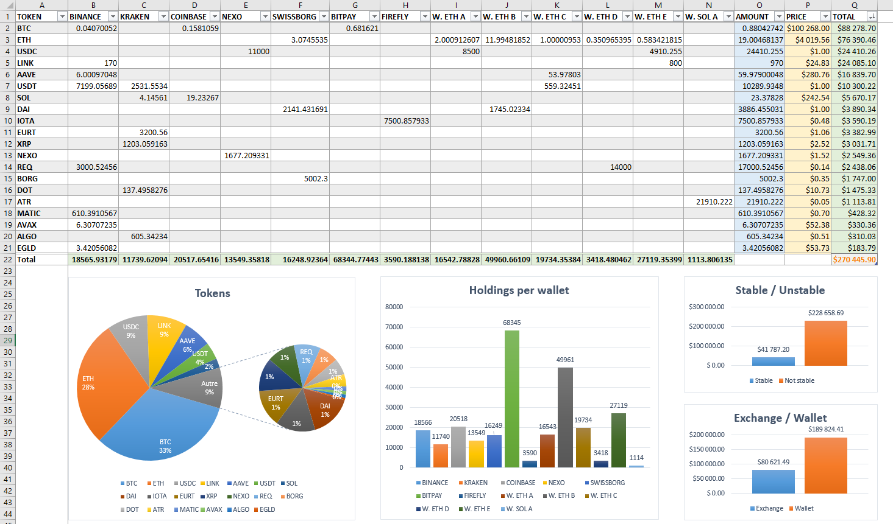

# Excel crypto tracker

Simple **Excel** file to track your cryptocurrency portfolio

---

# Table of Contents

* [About](#about)
* [Usage](#usage)
* [License](#license)

# About

This is a simple project to share the **Excel** file (XLSX format) I use to track my cryptocurrency portfolio.

It uses the https://cryptoprices.cc/ API to get the latest prices of the cryptocurrencies.

Cryptoprices.cc is a simple API that returns data as text, without usage limits and without requiring sign up or API key.

> [!NOTE]
> Note that at the time of writing the API only tracks the top 5000 coins by market capitalisation,
> so it is possible that your favorite coin is not available.
> Also note that data can be 1h late.
> You can find more info on the https://cryptoprices.cc/ website

# Usage

The file is at the root of this project : _[crypto_holdings.xlsx](crypto_holdings.xlsx)_

Simply download it and open it with Microsoft Excel.

The sheet lists the exchanges/wallets on the x-axis and the tokens on the y-axis.
All you have to do is to enter, for each token, the quantity held on the corresponding wallet or exchange.
You can of course add new tokens (rows) or exchanges/wallets (columns) as you wish.

It automatically displays the current price of each token (in USD), and calculates some totals :

- total quantity for each token
- total value for each token (in USD)
- total value on each exchange/wallet (in USD)
- total portfolio value

And diagrams :

- pie chart showing the distribution of tokens in terms of value
- bar chart showing the total holding per exchange/wallet
- bar chart showing the balance between stable coins and non-stable coins
- bar chart showing the distribution of tokens held on exchanges or wallets

Here's a screenshot :

(of course this is fake data -_-)

To force data refresh, use `Ctrl + Alt + F9`.

# License

MIT License

Copyright (c) 2024 Yann39

Permission is hereby granted, free of charge, to any person obtaining a copy
of this software and associated documentation files (the "Software"), to deal
in the Software without restriction, including without limitation the rights
to use, copy, modify, merge, publish, distribute, sublicense, and/or sell
copies of the Software, and to permit persons to whom the Software is
furnished to do so, subject to the following conditions:

The above copyright notice and this permission notice shall be included in all
copies or substantial portions of the Software.

THE SOFTWARE IS PROVIDED "AS IS", WITHOUT WARRANTY OF ANY KIND, EXPRESS OR
IMPLIED, INCLUDING BUT NOT LIMITED TO THE WARRANTIES OF MERCHANTABILITY,
FITNESS FOR A PARTICULAR PURPOSE AND NONINFRINGEMENT. IN NO EVENT SHALL THE
AUTHORS OR COPYRIGHT HOLDERS BE LIABLE FOR ANY CLAIM, DAMAGES OR OTHER
LIABILITY, WHETHER IN AN ACTION OF CONTRACT, TORT OR OTHERWISE, ARISING FROM,
OUT OF OR IN CONNECTION WITH THE SOFTWARE OR THE USE OR OTHER DEALINGS IN THE
SOFTWARE.